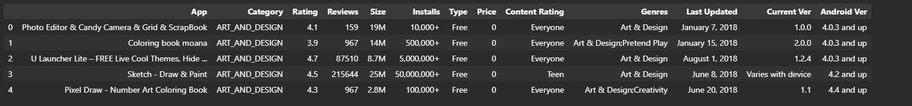
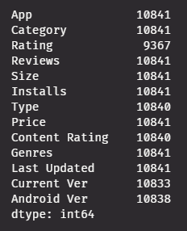
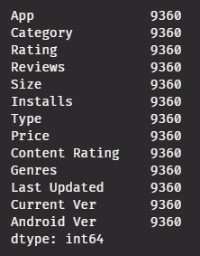
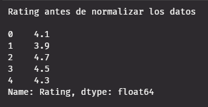
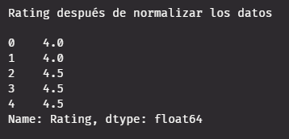

    

<h1 align="center">Google Play Store Web Scraping</h1>

Este repositorio presenta el análisis de datos realizado sobre un dataset de aplicaciones de la Google Play Store. El enfoque principal es la visualización de estos datos para permitir la identificación de correlaciones y la derivación de conclusiones sobre las diferentes categorías de aplicaciones.

> Enlace hacia el dataset en *`Kaggle`*: https://www.kaggle.com/datasets/lava18/google-play-store-apps/data

## Limpieza de los datos

En la limpieza se llevó a cabo simplemente aplicando la función
~~~
data_frame.dropna()
~~~
con la finalidad de borrar todos los valores *`Null`* o *`NaN`* que se pudieran encontrar dentro del dataset.

La cantidad de datos antes de realizar la limpieza fueron un total de 10,841 filas. Posterior a la limpieza nos quedamos con un total de 9,360 datos ya limpios y listos para utilizarse.

### Datos antes y después de la limpieza
<table>
    <tr>
        <th>Datos sin limpiar</th>
        <th>Datos limpios</th>
    </tr>
    <tr>
        <td></td>
        <td></td>
    </tr>
</table>

## Transformación de los datos
Para la transformación de los datos, para graficar ciertos datos como lo son los datos de la columna *`Rating`*, se normalizaron los datos para que los valores fueran modulos de entre 0.5 y 1 estrella entera.

### Datos antes y después de la normalización de la columna *Rating*
<table>
    <tr>
        <th>Datos sin normalizar</th>
        <th>Datos normalizados</th>
    </tr>
    <tr>
        <td></td>
        <td></td>
    </tr>
</table>

## Tablas de autoevaluación
### Miguel Espíldora Jara
<table>
    <tr>
        <th>Criterios</th>
        <th>Miguel Espíldora (Autoevaluación)</th>
        <th>Joan Retamales</th>
    </tr>
    <tr>
        <td>Contribución al trabajo en equipo</td>
        <td>15/15</td>
        <td>15/15</td>
    </tr>
    <tr>
        <td>Participación en la toma de desiciones</td>
        <td>15/15</td>
        <td>15/15</td>
    </tr>
    <tr>
        <td>Comunicación y colaboración</td>
        <td>8/10</td>
        <td>10/10</td>
    </tr>
    <tr>
        <td>Responsabilidad y cumplimiento de tareas</td>
        <td>20/20</td>
        <td>20/20</td>
    </tr>
    <tr>
        <td>Puntaje total</td>
        <td>58/60</td>
        <td>60/60</td>
    </tr>
</table>

### Joan Retamales Moya
<table>
    <tr>
        <th>Criterios</th>
        <th>Joan Retamales (Autoevaluación)</th>
        <th>Miguel Espíldora</th>
    </tr>
    <tr>
        <td>Contribución al trabajo en equipo</td>
        <td>15/15</td>
        <td>15/15</td>
    </tr>
    <tr>
        <td>Participación en la toma de desiciones</td>
        <td>15/15</td>
        <td>15/15</td>
    </tr>
    <tr>
        <td>Comunicación y colaboración</td>
        <td>10/10</td>
        <td>10/10</td>
    </tr>
    <tr>
        <td>Responsabilidad y cumplimiento de tareas</td>
        <td>18/20</td>
        <td>20/20</td>
    </tr>
    <tr>
        <td>Puntaje total</td>
        <td>58/60</td>
        <td>60/60</td>
    </tr>
</table>

Trabajo ejecutado y testeado sobre *`Python 3.12.4`*.